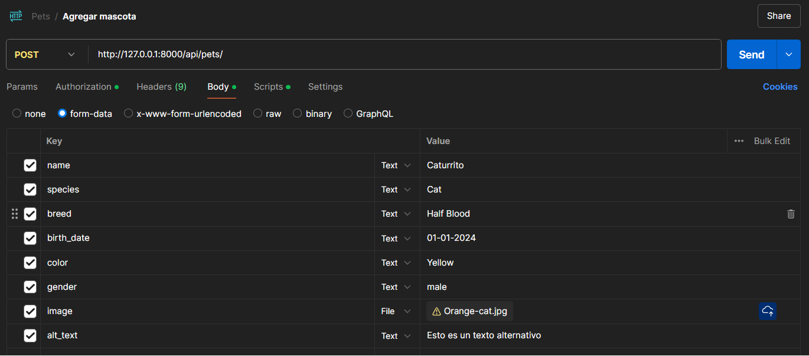

### Autenticación para Dueños de Mascotas (Pet Owners)

- **Registrar un nuevo dueño de mascota**
  - **URL:** `https://devs-devitm.com/api/pet_owner/register`
  - **Método:** `POST`
  - **Body:**
    ```json
    {
      "name": "John",
      "last_name": "Doe",
      "email": "johndoe@dogtoralia.com",
      "password": "Password123!",
      "password_confirmation": "Password123!",
      "phone_number": "1234567890"
    }
    ```

- **Login**
  - **URL:** `https://devs-devitm.com/api/pet_owner/login`
  - **Método:** `POST`
  - **Body:**
    ```json
    {
      "email": "johndoe@dogtoralia.com",
      "password": "Password123!"
    }
    ```

- **Refrescar token**
  - **URL:** `https://devs-devitm.com/api/pet_owner/refresh`
  - **Método:** `POST`
  - **Body:** *No requiere cuerpo*

- **Logout**
  - **URL:** `https://devs-devitm.com/api/pet_owner/logout`
  - **Método:** `POST`
  - **Body:** *No requiere cuerpo*
 
- **Obtener detalles de cuenta**

  - **URL:** `https://devs-devitm.com/api/pet_owner/me`
  - **Método:** `GET`
  - **Body:** *No requiere cuerpo*

> [!NOTE]  
> Con el siguiente endpoint los Business Owners y Staffs podrán ver cualquier perfil de Pet Owner.

- **Obtener detalles de un dueño de mascota**

  - **URL:** `https://devs-devitm.com/api/pet_owner/{id}`
  - **Método:** `GET`
  - **Body:** *No requiere cuerpo*

- **Actualizar información del dueño de mascota**
  - **URL:** `https://devs-devitm.com/api/pet_owner/update`
  - **Método:** `PUT`
  - **Body:**
    ```json
    {
      "name": "Updated Owner",
      "last_name": "Doe",
    }
    ```

- **Eliminar dueño de mascota**
  - **URL:** `https://devs-devitm.com/api/pet_owner/delete`
  - **Método:** `DELETE`
  - **Body:** *No requiere cuerpo*

- **Listar dueños de mascotas eliminados**
  - **URL:** `https://devs-devitm.com/api/pet_owner/trashed`
  - **Método:** `GET`
  - **Body:** *No requiere cuerpo*

- **Restaurar dueño de mascota eliminado**
  - **URL:** https://devs-devitm.com/api/pet_owner/restore/{id}`
  - **Método:** `POST`
  - **Body:** *No requiere cuerpo*

- **Eliminar permanentemente dueño de mascota**
  - **URL:** `https://devs-devitm.com/api/pet_owner/force_delete/{id}`
  - **Método:** `POST`
  - **Body:** *No requiere cuerpo*

****

### Autenticación y Gestión de Dueños de Negocios (Business Owners)

- **Registrar un nuevo dueño de negocio**
  - **URL:** `https://devs-devitm.com/api/business_owner/register`
  - **Método:** `POST`
  - **Body:**
    ```json
    {
      "name": "Alice",
      "last_name": "Johnson",
      "email": "alice@dogtoralia.com",
      "password": "Password123!",
      "password_confirmation": "Password123!",
      "phone_number": "1234567890",
      "rfc": "RFC123456789",
    }
    ```

- **Login**
  - **URL:** `https://devs-devitm.com/api/business_owner/login`
  - **Método:** `POST`
  - **Body:**
    ```json
    {
      "email": "alice@dogtoralia.com",
      "password": "Password123!"
    }
    ```

- **Refrescar token**
  - **URL:** `https://devs-devitm.com/api/business_owner/refresh`
  - **Método:** `POST`
  - **Body:** *No requiere cuerpo*

- **Logout**
  - **URL:** `https://devs-devitm.com/api/business_owner/logout`
  - **Método:** `POST`
  - **Body:** *No requiere cuerpo*

- **Obtener detalles del dueño de negocio autenticado**
  - **URL:** `https://devs-devitm.com/api/business_owner/me`
  - **Método:** `GET`
  - **Body:** *No requiere cuerpo*

- **Actualizar información del dueño de negocio**
  - **URL:** `https://devs-devitm.com/api/business_owner/update`
  - **Método:** `PUT`
  - **Body:**
    ```json
    {
      "name": "Alice",
      "last_name": "Updated",
   
    }
    ```

- **Eliminar dueño de negocio**
  - **URL:** `https://devs-devitm.com/api/business_owner/delete`
  - **Método:** `DELETE`
  - **Body:** *No requiere cuerpo*

- **Listar dueños de negocios eliminados**
  - **URL:** `https://devs-devitm.com/api/business_owner/trashed`
  - **Método:** `GET`
  - **Body:** *No requiere cuerpo*

- **Restaurar dueño de negocio eliminado**
  - **URL:** `https://devs-devitm.com/api/business_owner/restore/{id}`
  - **Método:** `POST`
  - **Body:** *No requiere cuerpo*

- **Eliminar permanentemente dueño de negocio**
  - **URL:** `https://devs-devitm.com/api/business_owner/force_delete/{id}`
  - **Método:** `POST`
  - **Body:** *No requiere cuerpo*
 
**** 
 
 ### Gestión de Negocios
 
> [!IMPORTANT]  
> Para gestionar los negocios debes estar autenticado como Business Owner

> [!TIP]
> Los endpoints de listar devuelven la respuesta con paginación. 
- **Paginación:** Los resultados se devuelven de 20 en 20 items por página por defecto.
- **Parámetros de consulta (`query params`):**
  - `page`: Número de página para la paginación.
  - `per_page`: Número de items por página. Por ejemplo, `https://devs-devitm.com/api/businesses/all?per_page=5` devolverá 5 items por página.

- **Listar todos los negocios de un mismo dueño**
   
  - **URL:** `https://devs-devitm.com/api/business`
  - **Método:** `GET`
  - **Body:** *No requiere cuerpo*

> [!NOTE]  
> El siguiente endpoint es para listar todos los negocios registrados en el sistema, no requiere autenticación.

- **Listar todos los negocios**
   
  - **URL:** `https://devs-devitm.com/api/business/all`
  - **Método:** `GET`
  - **Body:** *No requiere cuerpo*


- **Registrar un nuevo negocio**
  - **URL:** `https://devs-devitm.com/api/business/register`
  - **Método:** `POST`
  - **Body:**
    ```json
    {
      "name": "Veterinary Clinic",
      "phone_number": "0123456789",
      "email": "clinic@dogtoralia.com",
      "description": "A full-service veterinary clinic"
    }
    ```
- **Agregar dirección a un negocio**
  - **URL:** `https://devs-devitm.com/api/business/set-address/{business_id}`
  - **Método:** `POST`
  - **Body:**
    ```json
    {
     "lat":21.1202882,
     "lon":-86.9633669
    }
    ```

- **Obtener detalles de un negocio**
  - **URL:** `https://devs-devitm.com/api/business/{id}`
  - **Método:** `GET`
  - **Body:** *No requiere cuerpo*

- **Actualizar información de un negocio**
  - **URL:** `https://devs-devitm.com/api/business/{id}`
  - **Método:** `PUT`
  - **Body:**
    ```json
    {
      "description": "An updated description of the clinic"
    }
    ```

- **Eliminar un negocio**
  - **URL:** `https://devs-devitm.com/api/business/{id}`
  - **Método:** `DELETE`
  - **Body:** *No requiere cuerpo*

- **Listar negocios eliminados**
  - **URL:** `https://devs-devitm.com/api/business/trashed`
  - **Método:** `GET`
  - **Body:** *No requiere cuerpo*

- **Restaurar un negocio eliminado**
  - **URL:** `https://devs-devitm.com/api/business/restore/{id}`
  - **Método:** `POST`
  - **Body:** *No requiere cuerpo*

- **Eliminar permanentemente un negocio**
  - **URL:** `https://devs-devitm.com/api/business/force_delete/{id}`
  - **Método:** `POST`
  - **Body:** *No requiere cuerpo*

****

### Gestión de Mascotas

> [!IMPORTANT]  
> Debes estar autenticado como Pet Owner para gestionar tus mascotas

> [!TIP]
> Los endpoints de listar tienen paginación.
- **Paginación:** Los resultados se devuelven de 20 en 20 items por página por defecto.
- **Parámetros de consulta (`query params`):**
  - `page`: Número de página para la paginación.
  - `per_page`: Número de items por página. Por ejemplo, `https://devs-devitm.com/api/pets?per_page=3` devolverá 3 items por página.


  
> [!NOTE]
> El siguiente endpoint funciona para listar a todas las mascotas registradas en el sistema, debes estar autenticado como Business Owner o Staff (próximamente habrá un superusuario quien será quien pueda acceder a esta ruta).

- **Listar todas las mascotas**
  - **URL:** `https://devs-devitm.com/api/pets`
  - **Método:** `GET`
  - **Body:** No requiere cuerpo


> [!NOTE]
> El siguiente endpoint funciona para listar a todas las mascotas registradas de un usuario en específico, debes estar autenticado como Business Owner o Staff.

- **Listar todas las mascotas de un usuario**

  - **URL:** `https://devs-devitm.com/api/pets/index/{pet_owner_id}`
  - **Método:** `GET`
  - **Body:** *No requiere cuerpo*
 
> [!NOTE]
> El siguiente endpoint funciona para listar tus propias mascotas, debes estar autenticado como Pet Owner.


- **Listar todas mis mascotas**
  

  - **URL:** `https://devs-devitm.com/api/pets/index`
  - **Método:** `GET`
  - **Body:** *No requiere cuerpo*


> [!IMPORTANT]
> El siguiente endpoint permite subir una foto de tu mascota. Puedes probarlo en Postman enviando el body como form-data, añadiendo el campo `image` como tipo File y además puedes añadir un texto alternativo para tu foto añadiendo el campo `alt_text`.

- **Registrar una nueva mascota**
  - **URL:** `https://devs-devitm.com/api/pets`
  - **Método:** `POST`
  - **Body:**
    ```json
    {
      "name": "Buddy",
      "species": "Dog",
      "breed": "Labrador",
      "birth_date": "01-01-2020",
      "color": "Yellow",
      "gender": "Male"
    }
    ```
  - **Imagen de ejemplo para registrar mascota usando el form-data** 

- **Obtener detalles de una mascota**
  - **URL:** `https://devs-devitm.com/api/pets/{id}`
  - **Método:** `GET`
  - **Body:** *No requiere cuerpo*

- **Actualizar información de una mascota**
  - **URL:** `https://devs-devitm.com/api/pets/{id}`
  - **Método:** `PUT`
  - **Body:**
    ```json
    { 
      "color": "Golden"
    }
    ```

- **Eliminar una mascota**
  - **URL:** `https://devs-devitm.com/api/pets/{id}`
  - **Método:** `DELETE`
  - **Body:** *No requiere cuerpo*

****

### Gestión de Personal

- **Listar todo el personal**
  - **URL:** `https://devs-devitm.com/api/staff`
  - **Método:** `GET`
  - **Body:** *No requiere cuerpo*

- **Registrar un nuevo miembro del personal**
  - **URL:** `https://devs-devitm.com/api/staff`
  - **Método:** `POST`
  - **Body:**
    ```json
    {
      "name": "Dr. Smith",
      "last_name": "Johnson",
      "email": "drsmith@dogtoralia.com",
      "password": "Password123!",
      "password_confirmation": "Password123!",
      "phone_number": "1234567890",
      "business_id": 1
    }
    ```

- **Obtener detalles de un miembro del personal**
  - **URL:** `https://devs-devitm.com/api/staff/{id}`
  - **Método:** `GET`
  - **Body:** *No requiere cuerpo*

- **Actualizar información de un miembro del personal**
  - **URL:** `https://devs-devitm.com/api/staff/{id}`
  - **Método:** `PUT`
  - **Body:**
    ```json
    {
      "name": "Dr. John Smith",
    }
    ```

- **Eliminar un miembro del personal**
  - **URL:** `https://devs-devitm.com/api/staff/{id}`
  - **Método:** `DELETE`
  - **Body:** *No requiere cuerpo*

- **Listar personal eliminado**
  - **URL:** `https://devs-devitm.com/api/staff/trashed`
  - **Método:** `GET`
  - **Body:** *No requiere cuerpo*

- **Restaurar personal eliminado**
  - **URL:** `https://devs-devitm.com/api/staff/restore/{id}`
  - **Método:** `POST`
  - **Body:** *No requiere cuerpo*

- **Eliminar permanentemente un miembro del personal**
  - **URL:** `https://devs-devitm.com/api/staff/force_delete/{id}`
  - **Método:** `POST`
  - **Body:** *No requiere cuerpo*

- **Inicio de sesión de un staff**
  - **URL:** `https://devs-devitm.com/api/staff/login`
  - **Método:** `POST`
  - **Body:** 
      ```json
    {
      "email": "drsmith@dogtoralia.com",
      "password": "Password123!",
    }
    ```
- **Cierre de sesión de un staff**
  - **URL:** `https://devs-devitm.com/api/staff/logout`
  - **Método:** `POST`
  - **Body:** *No requiere cuerpo*
    
## Controlador de Servicios

> [!NOTE]  
> Se requiere estar autenticado como dueño de negocio para registrar, actualizar o eliminar algun servicio.

- **Listar servicios**
  - **URL:** `https://devs-devitm.com/api/services`
  - **Método:** `GET`
  - **Body:** *No requiere cuerpo*

- **Mostrar detalles de un servicio**
  - **URL:** `https://devs-devitm.com/api/services/{id}`
  - **Método:** `GET`
  - **Parámetros de URL:** `{id}`: ID del servicio que se desea obtener
 
> [!NOTE]  
> Puede no mandar nada para el campo categoria y se colocara `services` como categoria default.

- **Registrar un nuevo servicio**
    - **URL:** `https://devs-devitm.com/api/services`
    - **Método:** `POST`
    - **Body:**
      ```json
      {
        "name": "Baño de gatos",
        "description": "Bañamos bien a tu gatito",
        "price": 50.00,
        "currency": "MXN",
        "max_services_simultaneously": 5,
        "duration": 60,
        "category": "Estetica",
        "business_id": 1
      }
      ```
      
> [!NOTE]  
> Puede agregar los campos de oferta en actualizar servicio ya que estos campos de inicio pueden ser nulos y puede que al registrar el servicio no tenga alguna oferta

- **Actualizar un Servicio Existente**
    - **URL:** `https://devs-devitm.com/api/services/{id}`
    - **Método:** `PUT`
    - **Parámetros URL:** `{id}` (ID del servicio a actualizar)
    - **Body:**
      ```json
      {
        "name": "Baño de gatos y perros",
        "description": "Bañamos a tus gatos y perritos",
        "price": 60.00,
        "currency": "MXN",
        "max_services_simultaneously": 6,
        "duration": 60,
        "category": "Estetica",
        "discount_price": 55.00,
        "offer_start": "2024-08-01",
        "offer_end": "2024-08-31"
      }
      ```
     
- **Eliminar un servicio**
  - **URL:** `https://devs-devitm.com/api/services/{id}`
  - **Método:** `Delete`
  - **Parámetros de URL:** `{id}`: ID del servicio que se desea eliminar
  - **Body:** *No requiere cuerpo*

